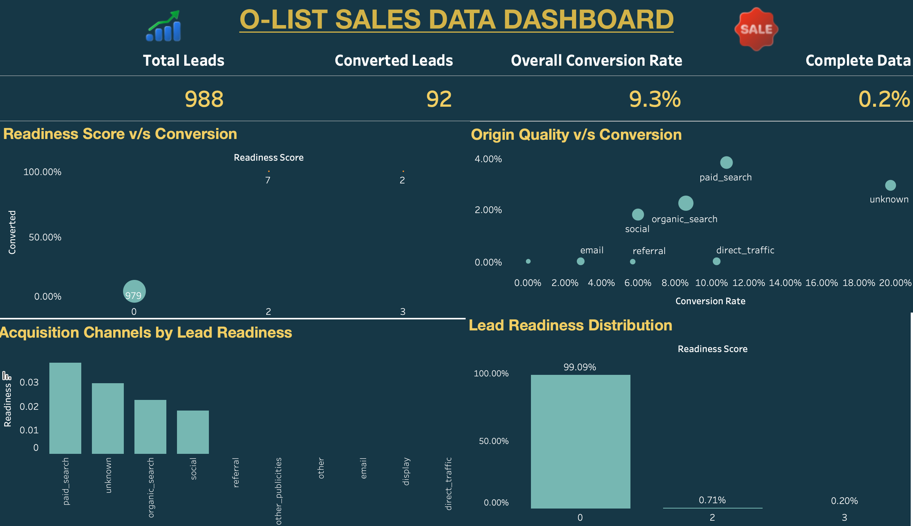

# Lead Quality & Conversion Analysis

This project explores how **lead quality and data completeness influence conversion outcomes** in a marketing funnel.

Using SQL, Excel, and Tableau, the dataset was cleaned, enriched with additional metrics, and visualized through an interactive dashboard to identify patterns in lead readiness and acquisition channel performance.

The goal of this analysis was to understand:

- Do higher quality leads convert more often?
- Which acquisition channels bring better leads into the funnel?
- How does missing lead information affect conversion rates?

---

## Tools Used

**SQL**  
Used to build the data pipeline, merge datasets, and engineer new lead quality metrics.

**Excel**  
Used for initial data exploration and quick validation checks.

**Tableau**  
Used to create an interactive dashboard to visualize conversion trends and lead readiness patterns.

---

## Dataset

The project uses two datasets:

- **Leads dataset** – contains marketing qualified leads with acquisition channel and profile attributes.
- **Closed deals dataset** – contains leads that converted into customers.

Both datasets were combined using SQL to build a structured **marketing funnel dataset**.

The final dataset contains approximately **1000 leads** with attributes such as:

- acquisition origin  
- declared revenue  
- product catalog size  
- stock availability  
- company information  
- behavioural profile  

---

## Data Preparation

A SQL pipeline was created to transform the raw datasets into a clean analytical table.

The pipeline performs the following steps:

1. Merge leads and closed deals datasets.
2. Create a **conversion flag** to identify successful deals.
3. Calculate **missing fields count** to measure data completeness.
4. Build a **lead readiness score** based on available business signals.
5. Create a **friction score** representing missing qualification signals.
6. Classify leads into **high or low completeness levels**.

The final processed dataset is stored as:

```
05_funnel_base.csv
```

---

## Key Insights

- Nearly **99% of leads have a readiness score of 0**, meaning most leads enter the funnel with very little qualifying information.

- Despite low data completeness, the **overall conversion rate is around 9%**.

- Acquisition channels such as **Paid Search and Organic Search** tend to bring slightly higher readiness leads compared to other sources.

- A large portion of leads lack critical business information, indicating an opportunity to **improve data collection during lead acquisition**.

- Improving **lead qualification and data completeness** could significantly improve conversion outcomes.

---

## Dashboard Preview



The Tableau dashboard visualizes:

- total leads and conversions  
- conversion rates by acquisition channel  
- lead readiness distribution  
- relationship between readiness score and conversions  

---

## Project Structure

```
lead-quality-conversion-analysis
│
├ README.md
├ 02_leads_cleaned.csv
├ 03_closed_cleaned.csv
├ 04_lead_quality_conversion_analysis.sql
├ 05_funnel_base.csv
└ 06_olist_sales_dashboard.png
```

---

## Author

Shraddha Dangwal 
